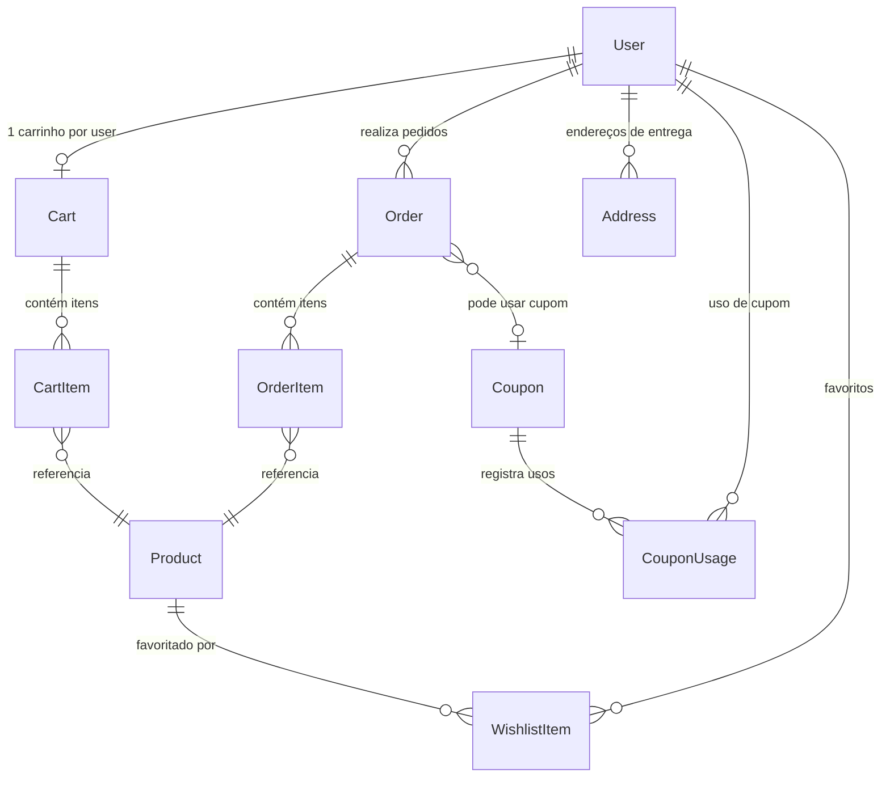

<p align="center">
  <h1 align="center">📚 E-commerce 8-Bit Books — Livraria<!-- E-commerce LAPES — Livraria --></h1>
  <p align="center">
    <strong>E-commerce Simplificado de Livros — Desafio Técnico 8-Bit Books 2026<!-- Desafio Técnico LAPES 2026 --></strong>
  </p>
  <p align="center">
    
    
    
    
    
    
    
    
  </p>
</p>

---

## Índice

- [Descrição](#descrição)
- [Stack Técnica](#stack-técnica)
- [Arquitetura](#arquitetura)
- [Estrutura do Projeto](#estrutura-do-projeto)
- [Modelagem do Banco](#modelagem-do-banco)
- [Endpoints da API](#endpoints-da-api)
- [Fluxo de Uso](#fluxo-de-uso)
- [Decisões Técnicas](#decisões-técnicas)
- [Como Rodar](#como-rodar)
- [Variáveis de Ambiente](#variáveis-de-ambiente)
- [Seed](#seed)
- [Testes](#testes)
- [Diferenciais Implementados](#diferenciais-implementados)
- [Autores](#autores)

---

## Descrição

API RESTful de e-commerce de **livros** desenvolvida como desafio técnico do processo seletivo **8-Bit Books 2026<!-- LAPES 2026 -->**. O sistema implementa um fluxo de compra completo — do cadastro do usuário até a entrega do pedido — com integração real de pagamentos via **Stripe**.

Todos os **5 domínios de negócio** exigidos estão implementados: **Autenticação & Usuários**, **Catálogo de Produtos**, **Carrinho de Compras**, **Checkout & Pedidos** e **Cupons de Desconto**, além de módulos extras: **Endereços de Entrega**, **Wishlist/Favoritos** e **Health Check**.

> 📖 Documentação interativa da API disponível via **Swagger** em `/docs` ao rodar o servidor.

---

## Stack Técnica

| Camada | Tecnologia | Justificativa |
|--------|-----------|---------------|
| **Runtime** | Node.js 20 (Alpine) | LTS com performance otimizada |
| **Framework** | NestJS 10 | Arquitetura modular, injeção de dependências, decorators |
| **Linguagem** | TypeScript 5 | Tipagem estática em todo o projeto |
| **ORM** | Prisma 5 | Client 100% tipado, migrations versionadas |
| **Banco** | PostgreSQL 16 | Suporte a transações SERIALIZABLE e `SELECT ... FOR UPDATE` |
| **Cache** | Redis 7 | Cache de produtos + distributed lock para checkout |
| **Pagamentos** | Stripe | Gateway real com webhooks para confirmação assíncrona |
| **Auth** | Passport + JWT + Bcrypt | Autenticação stateless com hash seguro |
| **Docs** | Swagger / OpenAPI | Documentação interativa com exemplos |
| **Validação** | class-validator + class-transformer | Validação de input nas bordas da API |
| **Rate Limiting** | @nestjs/throttler | Proteção contra abuso em endpoints públicos |
| **Logs** | Logger Middleware (JSON) | Toda request logada com timestamp, método, rota, status, duração |
| **Testes** | Jest | 133 testes unitários cobrindo todos os serviços |
| **CI** | GitHub Actions | Pipeline automatizada: lint → build → test com coverage |
| **Containers** | Docker + Compose | Setup zero-config com 4 serviços orquestrados |

---

## Arquitetura

O projeto segue o padrão **Modular Monolith** do NestJS — cada domínio é um módulo isolado com controller, service e DTOs próprios.

```
                         Cliente HTTP
                              │
                              ▼
                     ┌─────────────────┐
                     │  NestJS (:3000) │
                     │  Global Pipes   │
                     │  ThrottlerGuard │
                     │  LoggerMiddle.  │
                     │  ExceptionFilter│
                     └───────┬─────────┘
                             │
          ┌──────────────────┼──────────────────┐
          │                  │                  │
    ┌─────▼─────┐     ┌─────▼──────┐    ┌─────▼──────┐
    │   Auth    │     │  Products  │    │    Cart    │
    │  Module   │     │  Module    │    │   Module   │
    └───────────┘     └────────────┘    └────────────┘
          │                  │                  │
    ┌─────▼─────┐     ┌─────▼──────┐    ┌─────▼──────┐
    │  Orders   │     │  Coupons   │    │ Addresses  │
    │  Module   │     │  Module    │    │   Module   │
    └───────────┘     └────────────┘    └────────────┘
          │                                    │
    ┌─────▼──────┐                      ┌──────▼─────┐
    │  Stripe    │                      │  Wishlist  │
    │  Service   │── Webhooks Ctrl      │  Module    │
    └────────────┘                      └────────────┘
          │
          ▼
  ┌───────────────────────────────────────────────┐
  │                 Common Layer                  │
  │  PrismaService  │  RedisService  │  Filters   │
  └───────┬─────────┴───────┬────────┴────────────┘
          │                 │
    ┌─────▼─────┐    ┌──────▼──────┐
    │ PostgreSQL│    │   Redis 7   │
    │  (:5432)  │    │   (:6379)   │
    └───────────┘    └─────────────┘
```

---

## Estrutura do Projeto

```
ecommerce-lapes/
├── .github/workflows/ci.yml       # Pipeline CI (lint → build → test)
│
├── prisma/
│   ├── migrations/                 # Migrations versionadas
│   ├── schema.prisma               # Schema do banco (9 models, 3 enums)
│   └── seed.ts                     # Dados de desenvolvimento (livros)
│
├── src/
│   ├── common/                     # Camada compartilhada
│   │   ├── filters/                #   └── Exception filter global
│   │   ├── logger/                 #   └── Logger JSON (toda request)
│   │   ├── prisma/                 #   └── PrismaService (módulo global)
│   │   └── redis/                  #   └── RedisService (cache + distributed lock)
│   │
│   ├── modules/                    # Domínios de negócio
│   │   ├── auth/                   # Registro, login, perfil, update, senha, JWT, RBAC
│   │   ├── products/               # CRUD + filtros + paginação + cache + categorias
│   │   ├── cart/                   # Carrinho persistido (1 por usuário)
│   │   ├── orders/                 # Checkout atômico + Stripe + webhooks
│   │   ├── coupons/                # CRUD + validação (PERCENT / FIXED)
│   │   ├── addresses/              # CRUD + endereço padrão
│   │   └── wishlist/               # Favoritos (adicionar, remover, listar, verificar)
│   │
│   ├── health.controller.ts        # Health check (DB + Redis)
│   ├── app.module.ts               # Módulo raiz + ThrottlerGuard global
│   └── main.ts                     # Bootstrap + Swagger + CORS + ExceptionFilter
│
├── docker-compose.yml              # API + Postgres + Redis + Redis Commander
├── Dockerfile                      # Multi-stage (base → builder → production)
└── .env.example                    # Template de variáveis
```

Cada módulo em `modules/` segue o mesmo padrão: `controller` + `service` + `dto/` + `*.spec.ts`.
O módulo `orders/` inclui ainda `stripe.service.ts` e `webhooks.controller.ts` para integração com pagamentos.

---

## Modelagem do Banco

O schema Prisma define **9 models** e **3 enums**, com migrations versionadas no diretório `prisma/migrations/`.

### Diagrama de Relações



### Enums

| Enum | Valores |
|------|---------|
| `Role` | `ADMIN`, `CUSTOMER` |
| `OrderStatus` | `PENDING` → `PAID` → `SHIPPED` → `DELIVERED` · `CANCELLED` |
| `CouponType` | `PERCENT`, `FIXED` |

### Regras de Integridade

| Regra | Implementação |
|-------|---------------|
| Campos monetários | `Decimal(10,2)` — evita erros de ponto flutuante |
| Produto único no carrinho | `@@unique([cartId, productId])` em CartItem |
| Cupom uso único por usuário | `@@unique([couponId, userId])` em CouponUsage |
| Produto único na wishlist | `@@unique([userId, productId])` em WishlistItem |
| Snapshot de preço | `priceAtPurchase` em OrderItem — preço congelado no checkout |
| Soft delete | `deletedAt` em Product — preserva integridade de pedidos históricos |
| Cascade delete | `onDelete: Cascade` em CartItem e OrderItem |
| Snapshot de endereço | Campos `shipping*` no Order — endereço copiado no checkout |

---

## Endpoints da API

> Documentação interativa completa em `/docs` (Swagger).

### Auth

| Método | Rota | Descrição | Auth | Rate Limit |
|--------|------|-----------|------|------------|
| `POST` | `/auth/register` | Registra novo customer | ❌ | 5 req/min |
| `POST` | `/auth/login` | Autentica e retorna JWT | ❌ | 10 req/min |
| `GET` | `/auth/me` | Retorna perfil do usuário logado | 🔒 Bearer | Global |
| `PATCH` | `/auth/me` | Atualiza perfil (nome, sobrenome, telefone) | 🔒 Bearer | Global |
| `PATCH` | `/auth/me/password` | Altera a senha (requer senha atual) | 🔒 Bearer | Global |

### Products

| Método | Rota | Descrição | Auth | Cache |
|--------|------|-----------|------|-------|
| `GET` | `/products` | Lista com filtros e paginação | ❌ | ✅ Redis |
| `GET` | `/products/categories` | Lista categorias disponíveis | ❌ | ✅ Redis |
| `GET` | `/products/:id` | Detalha um produto | ❌ | ✅ Redis |
| `POST` | `/products` | Cria produto | 🔒 Admin | Invalida |
| `PATCH` | `/products/:id` | Atualiza produto | 🔒 Admin | Invalida |
| `DELETE` | `/products/:id` | Remove via soft delete | 🔒 Admin | Invalida |

**Filtros disponíveis:** `?search=` (busca em nome **e** descrição), `?category=`, `?minPrice=`, `?maxPrice=`, `?page=`, `?limit=`, `?sortBy=`, `?order=`

### Cart

| Método | Rota | Descrição | Auth |
|--------|------|-----------|------|
| `GET` | `/cart` | Retorna carrinho do usuário | 🔒 Bearer |
| `POST` | `/cart/items` | Adiciona item (valida estoque) | 🔒 Bearer |
| `PATCH` | `/cart/items/:id` | Atualiza quantidade (valida estoque) | 🔒 Bearer |
| `DELETE` | `/cart/items/:id` | Remove item | 🔒 Bearer |
| `DELETE` | `/cart` | Limpa carrinho | 🔒 Bearer |

### Orders

| Método | Rota | Descrição | Auth |
|--------|------|-----------|------|
| `POST` | `/orders/checkout` | Cria pedido (reserva atômica de estoque) | 🔒 Bearer |
| `GET` | `/orders` | Lista pedidos (admin vê todos) | 🔒 Bearer |
| `GET` | `/orders/:id` | Detalha pedido | 🔒 Bearer |
| `PATCH` | `/orders/:id/cancel` | Cancela pedido (antes de SHIPPED) | 🔒 Bearer |
| `PATCH` | `/orders/:id/status` | Avança status (máquina de estados) | 🔒 Admin |

### Coupons

| Método | Rota | Descrição | Auth |
|--------|------|-----------|------|
| `POST` | `/coupons` | Cria cupom | 🔒 Admin |
| `GET` | `/coupons` | Lista todos os cupons | 🔒 Admin |
| `GET` | `/coupons/:id` | Detalha cupom + usos | 🔒 Admin |
| `PATCH` | `/coupons/:id` | Atualiza cupom | 🔒 Admin |
| `DELETE` | `/coupons/:id` | Remove cupom (se sem pedidos) | 🔒 Admin |
| `POST` | `/coupons/validate` | Valida cupom antes do checkout | 🔒 Bearer |

### Addresses

| Método | Rota | Descrição | Auth |
|--------|------|-----------|------|
| `POST` | `/addresses` | Cadastra endereço (máx 5) | 🔒 Bearer |
| `GET` | `/addresses` | Lista endereços do usuário | 🔒 Bearer |
| `GET` | `/addresses/:id` | Detalha endereço | 🔒 Bearer |
| `PATCH` | `/addresses/:id` | Atualiza endereço | 🔒 Bearer |
| `DELETE` | `/addresses/:id` | Remove endereço | 🔒 Bearer |
| `PATCH` | `/addresses/:id/default` | Define como padrão | 🔒 Bearer |

### Wishlist

| Método | Rota | Descrição | Auth |
|--------|------|-----------|------|
| `GET` | `/wishlist` | Lista favoritos do usuário | 🔒 Bearer |
| `POST` | `/wishlist/:productId` | Adiciona livro aos favoritos | 🔒 Bearer |
| `DELETE` | `/wishlist/:productId` | Remove livro dos favoritos | 🔒 Bearer |
| `GET` | `/wishlist/:productId/check` | Verifica se livro está favoritado | 🔒 Bearer |

### Health & Webhooks

| Método | Rota | Descrição | Auth |
|--------|------|-----------|------|
| `GET` | `/health` | Verifica saúde da API (DB + Redis) | ❌ |
| `POST` | `/webhooks/stripe` | Recebe eventos do Stripe | Assinatura Stripe |

---

## Fluxo de Uso

### Jornada do Customer (comprador de livros)

```
1. REGISTRO           POST /auth/register
   ↓                  (nome, email, CPF, senha, telefone, nascimento)
2. LOGIN              POST /auth/login → recebe JWT
   ↓
3. PERFIL             GET /auth/me (ver perfil)
   │                  PATCH /auth/me (atualizar nome/telefone)
   │                  PATCH /auth/me/password (trocar senha)
   ↓
4. ENDEREÇO           POST /addresses (cadastrar endereço de entrega)
   ↓
5. NAVEGAR            GET /products?search=tolkien (busca por nome ou descrição)
   │                  GET /products?category=fantasia (filtrar por categoria)
   │                  GET /products/categories (listar categorias)
   │                  GET /products/:id (detalhar livro)
   ↓
6. FAVORITAR          POST /wishlist/:productId (salvar pra depois)
   │                  GET /wishlist (ver meus favoritos)
   ↓
7. CARRINHO           POST /cart/items (adicionar livro ao carrinho)
   │                  PATCH /cart/items/:id (alterar quantidade)
   │                  DELETE /cart/items/:id (remover item)
   │                  GET /cart (ver carrinho)
   ↓
8. CUPOM              POST /coupons/validate (testar cupom antes de comprar)
   ↓
9. CHECKOUT           POST /orders/checkout → cria pedido + Stripe PaymentIntent
   │                  (reserva estoque, aplica cupom, snapshot do endereço)
   │                  ← retorna { order, clientSecret }
   ↓
10. PAGAMENTO         Frontend confirma pagamento via Stripe.js
    │                 Stripe → POST /webhooks/stripe (payment_intent.succeeded)
    │                 → Pedido atualizado para PAID automaticamente
    ↓
11. ACOMPANHAR        GET /orders (listar meus pedidos)
    │                 GET /orders/:id (detalhar pedido)
    ↓
12. CANCELAR?         PATCH /orders/:id/cancel (antes de SHIPPED)
                      → estoque devolvido + refund no Stripe
```

### Jornada do Admin (gerente da livraria)

```
1. LOGIN              POST /auth/login → JWT com role ADMIN
   ↓
2. GERENCIAR          POST /products (cadastrar novo livro)
   CATÁLOGO           PATCH /products/:id (atualizar preço/estoque)
                      DELETE /products/:id (remover livro — soft delete)
   ↓
3. GERENCIAR          POST /coupons (criar cupom de desconto)
   CUPONS             PATCH /coupons/:id (editar valor/validade)
                      DELETE /coupons/:id (remover cupom)
   ↓
4. GERENCIAR          GET /orders (ver todos os pedidos)
   PEDIDOS            PATCH /orders/:id/status (avançar: PAID→SHIPPED→DELIVERED)
                      PATCH /orders/:id/cancel (cancelar pedido de qualquer customer)
   ↓
5. MONITORAR          GET /health (verificar status do DB e Redis)
```

---

## Decisões Técnicas

### Controle de Concorrência (Anti-Overselling)

O checkout é protegido por **3 camadas** contra venda duplicada do último livro:

1. **Distributed Lock (Redis)** — `acquireLock()` com token UUID e TTL configurável impede dois checkouts simultâneos do mesmo usuário
2. **Transação SERIALIZABLE (Prisma)** — nível de isolamento máximo do PostgreSQL
3. **Lock pessimista (`SELECT ... FOR UPDATE`)** — trava as linhas dos produtos envolvidos dentro da transação

```
Checkout Request
       │
       ▼
  Redis Lock ──── Lock adquirido? ──► Não → 409 Conflict
       │
      Sim
       │
       ▼
  $transaction(SERIALIZABLE)
       │
       ├── SELECT ... FOR UPDATE (produtos)
       ├── Validação de estoque
       ├── Decremento atômico de estoque
       ├── Criação do pedido + items
       ├── Registro de uso de cupom
       └── Limpeza do carrinho
       │
       ▼
  Stripe PaymentIntent
       │
       ▼
  Liberação do Redis Lock
```

### Integração Stripe

- **Criação real de PaymentIntent** durante o checkout — retorna `client_secret` para o frontend
- **Webhook** recebe `payment_intent.succeeded` e `payment_intent.payment_failed` com validação de assinatura
- **Refund automático** ao cancelar pedidos com pagamento processado
- **Graceful degradation**: se Stripe estiver indisponível, o pedido é criado mesmo assim (pagamento pode ser retentado)

### Idempotência no Checkout

O campo `idempotencyKey` (opcional) no checkout garante **retry seguro** — se a mesma key é enviada novamente, o pedido existente é retornado sem criar duplicatas.

### Cache de Produtos (Redis)

- **Lista**: chave `products:list:<hash_dos_filtros>` com TTL de 10 minutos (configurável)
- **Detalhe**: chave `products:detail:<id>` com TTL de 15 minutos (configurável)
- **Categorias**: chave `products:categories` com TTL de 10 minutos
- **Invalidação**: automática ao criar, atualizar ou remover produto, e ao finalizar checkout/cancelamento
- Hash MD5 dos filtros como chave para suportar diferentes combinações de busca

### Máquina de Estados do Pedido

```
PENDING ──► PAID ──► SHIPPED ──► DELIVERED
   │           │
   └───────────┴──► CANCELLED (com devolução de estoque)
```

- Cancelamento permitido apenas nos estados `PENDING` e `PAID`
- Ao cancelar, o estoque é devolvido **atomicamente** dentro de uma transação
- Transições são validadas por uma lookup table `VALID_TRANSITIONS`

### Segurança

- **Senhas**: Bcrypt com 10 salt rounds — nunca retornadas nas responses
- **JWT**: payload `{sub, email, role}`, expiração configurável
- **RBAC**: `RolesGuard` + `@Roles()` decorator para proteção por papel
- **Rate Limiting**: ThrottlerGuard global (30 req/min) + overrides por rota
- **Validação**: `ValidationPipe` global com `whitelist: true` + `forbidNonWhitelisted: true`
- **Erros**: `GlobalExceptionFilter` padroniza respostas sem expor stack traces
- **Webhook**: validação de assinatura Stripe antes de processar eventos
- **rawBody**: habilitado para receber payload bruto do Stripe

### Logs (JSON Estruturado)

Todas as requisições são logadas com:

```json
{
  "timestamp": "2026-06-02T20:15:30.123Z",
  "method": "POST",
  "route": "/orders/checkout",
  "statusCode": 201,
  "duration": "142ms"
}
```

Erros são capturados pelo `GlobalExceptionFilter` e retornados em formato padronizado:

```json
{
  "statusCode": 409,
  "message": "Estoque insuficiente para \"1984\". Disponível: 0, solicitado: 1.",
  "timestamp": "2026-06-02T20:15:30.123Z",
  "path": "/orders/checkout"
}
```

---

## Como Rodar

### Pré-requisitos

- [Docker](https://www.docker.com/) e Docker Compose

### Com Docker (recomendado) — Setup Zero-Config

```bash
# Clone e rode — só isso!
git clone https://github.com/kiovaz/processo-seletivo-2026.git
cd processo-seletivo-2026
docker compose up
```

> **Tudo é automático:** o `depends_on` com healthcheck garante que Postgres e Redis estejam prontos antes da API subir. Em seguida, o container da API aplica as migrations, popula o banco com seed e inicia com hot-reload.

Ao subir, os seguintes serviços estarão disponíveis:

| Serviço | URL | Descrição |
|---------|-----|-----------|
| 🌐 **API** | http://localhost:3000 | Endpoints REST |
| 📖 **Swagger** | http://localhost:3000/docs | Documentação interativa |
| 📊 **Redis Commander** | http://localhost:8081 | Visualizar cache Redis |
| 🎨 **Prisma Studio** | http://localhost:5555 | Visualizar banco (sob demanda) |

**Credenciais de teste:**

| Papel | Email | Senha |
|-------|-------|-------|
| 🔑 Admin | `caiovasconcelos01@live.com` | `123456` |
| 🛒 Customer | `edgar@email.com` | `123456` |

> **Nota:** O projeto funciona sem `.env` — valores padrão de desenvolvimento estão configurados. Para customizar, copie `.env.example` para `.env` e ajuste.

### Guia de Comandos Docker

| Comando | Descrição |
|---------|-----------|
| `docker compose up` | Sobe tudo com logs no terminal |
| `docker compose up -d` | Sobe tudo em background |
| `docker compose up -d --build` | Rebuilda a imagem e sobe |
| `docker compose down` | Para e remove containers |
| `docker compose down -v` | Para tudo **e apaga volumes** (reset total) |
| `docker compose logs -f api` | Logs da API em tempo real |
| `docker compose restart api` | Reinicia apenas a API |

### Comandos Prisma (dentro do container)

| Comando | Descrição |
|---------|-----------|
| `docker exec -it ecommerce-api npx prisma studio --hostname 0.0.0.0 --port 5555` | Abre Prisma Studio (porta 5555) |
| `docker exec -it ecommerce-api npx prisma migrate deploy` | Aplica migrations pendentes |
| `docker exec -it ecommerce-api npx prisma db seed` | Re-executa o seed |
| `docker exec -it ecommerce-api npx prisma migrate reset --force` | Reset total do banco |

### Sem Docker (desenvolvimento local)

```bash
# Instale as dependências
npm install

# Configure .env apontando para seu PostgreSQL e Redis locais
cp .env.example .env

# Gere o Prisma Client e rode migrations
npx prisma generate
npx prisma migrate dev

# Execute o seed
npx prisma db seed

# Inicie em modo desenvolvimento (hot-reload)
npm run start:dev
```

---

## Variáveis de Ambiente

Copie o `.env.example` e ajuste conforme necessário:

| Variável | Descrição | Default |
|----------|-----------|---------|
| `DATABASE_URL` | Connection string do PostgreSQL | `postgresql://postgres:postgres@db:5432/ecommerce` |
| `REDIS_URL` | Connection string do Redis | `redis://redis:6379` |
| `JWT_SECRET` | Chave secreta para assinar tokens | `my-secret-dev-key123` |
| `JWT_EXPIRES_IN` | Tempo de expiração do JWT | `7d` |
| `STRIPE_SECRET_KEY` | Chave secreta do Stripe | — |
| `STRIPE_PUBLIC_KEY` | Chave pública do Stripe | — |
| `STRIPE_WEBHOOK_SECRET` | Secret do webhook Stripe | — |
| `CACHE_PRODUCTS_LIST_TTL` | TTL do cache de lista (ms) | `600000` (10 min) |
| `CACHE_PRODUCTS_DETAIL_TTL` | TTL do cache de detalhe (ms) | `900000` (15 min) |
| `CHECKOUT_LOCK_TTL_MS` | TTL do lock de checkout (ms) | `30000` (30s) |
| `PORT_API` | Porta da API | `3000` |
| `PORT_POSTGRES` | Porta do PostgreSQL | `5432` |
| `PORT_REDIS` | Porta do Redis | `6379` |
| `POSTGRES_USER` | Usuário do PostgreSQL | `postgres` |
| `POSTGRES_PASSWORD` | Senha do PostgreSQL | `postgres` |
| `POSTGRES_DB` | Nome do banco | `ecommerce` |

---

## Seed

O seed (`prisma/seed.ts`) popula o banco com dados de desenvolvimento:

| Entidade | Dados |
|----------|-------|
| **Usuários** | `caiovasconcelos01@live.com` (ADMIN) + `edgar@email.com` (CUSTOMER) — senha: `123456` |
| **Endereços** | 3 endereços (2 do customer + 1 do admin) |
| **Livros** | 5 livros: O Senhor dos Anéis (R$89,90), Clean Code (R$59,90), Sapiens (R$44,90), Design Patterns (R$79,90), 1984 (R$29,90) |
| **Categorias** | fantasia, tecnologia, historia, ficcao |
| **Cupons** | `LAPES10` (10% off, mín R$50) + `FRETE20` (R$20 off, mín R$100) |
| **Carrinho** | Carrinho do Edgar com O Senhor dos Anéis (×2) e Sapiens (×1) |
| **Favoritos** | Edgar tem Clean Code e Design Patterns na wishlist |

```bash
# Executar seed manualmente
npx prisma db seed

# Reset total (drop + migrate + seed)
npx prisma migrate reset --force
```

O seed é **idempotente** — ele limpa todas as tabelas antes de inserir, podendo ser executado quantas vezes necessário.

---

## Testes

**133 testes unitários** cobrindo os fluxos críticos de todos os 7 módulos:

| Módulo | Testes | Fluxos cobertos |
|--------|--------|-----------------|
| **Auth** | 14 | registro, login, perfil, atualizar perfil, trocar senha |
| **Products** | 15 | CRUD, cache HIT/MISS, filtros, paginação, busca em nome+descrição |
| **Cart** | 17 | adicionar, remover, atualizar, limpar, validação de estoque |
| **Orders** | 44 | checkout, concorrência (lock distribuído + FOR UPDATE), cupons, cancelamento, status, webhooks |
| **Coupons** | 20 | CRUD, validação (expirado, já usado, mín. não atingido, % > 100) |
| **Addresses** | 11 | CRUD, endereço padrão, limite de 5, acesso indevido |
| **Wishlist** | 10 | adicionar, remover, listar, verificar, produto inexistente, duplicado |

```bash
# Rodar testes
npm test

# Watch mode
npm run test:watch

# Cobertura
npm test -- --coverage
```

### Pipeline CI (GitHub Actions)

Executada em todo **push** e **PR** para `main`:

1. Checkout → Setup Node 20 → `npm ci`
2. `prisma generate` → `prisma migrate deploy`
3. Lint (`eslint`)
4. Build (`nest build`)
5. Testes com cobertura (`jest --coverage`)

Services no CI: PostgreSQL 16 + Redis 7 com health checks.

---

## Diferenciais Implementados

| Diferencial | Status | Detalhe |
|-------------|--------|---------|
| Soft delete em produtos | ✅ | Campo `deletedAt` preserva integridade de pedidos históricos |
| Gateway de pagamento real (Stripe) | ✅ | PaymentIntent, webhooks, refunds |
| Idempotência no checkout | ✅ | `idempotencyKey` para retry seguro |
| Snapshot de endereço no pedido | ✅ | Campos `shipping*` congelados no momento do checkout |
| Distributed Lock (Redis) | ✅ | Lock com token UUID + Lua script para release atômico |
| Health check | ✅ | `GET /health` verifica PostgreSQL + Redis |
| Wishlist / Favoritos | ✅ | Módulo completo com 4 endpoints e 10 testes |
| Busca em nome + descrição | ✅ | `OR` query com `contains` case-insensitive |
| Atualização de perfil e senha | ✅ | `PATCH /auth/me` e `PATCH /auth/me/password` |

---

## Autores

| Nome | GitHub |
|------|--------|
| **Caio Vasconcelos** | [@kiovaz](https://github.com/kiovaz) |
| **Edgar Klewert** | [@edgarklewert](https://github.com/Edgar-Klewert) |